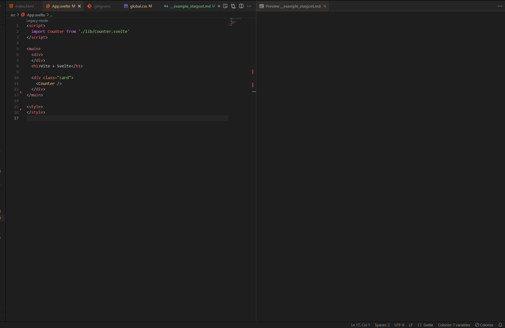

# StarPost

Copy code with contextual metadata automatically appended. 

StarPost wraps your selection in a Markdown code block and adds git info (repo, branch, short commit, staging status), filename, and line numbers for easy sharing and archiving.

## Features

Adds a status bar item to copy the current text editor selection with additional contextual information.

Adds the following contextual information into the clipboard:
  - Git (if available):
    - repo
    - branch
    - commit hash (short)
    - number of staged, unstaged, and untracked files
  - Markdown formatted code block of copied text (with language tag)
  - File name
  - Start and end line of selection

## Contributing

Pull requests are welcome. For major changes, please open an issue first to discuss what you would like to change.

## Release Notes

### 1.0.0

Initial release of StarPost